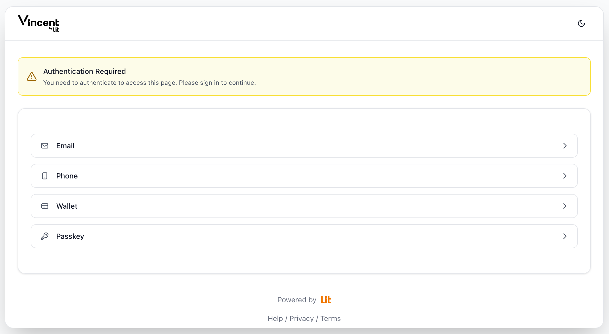
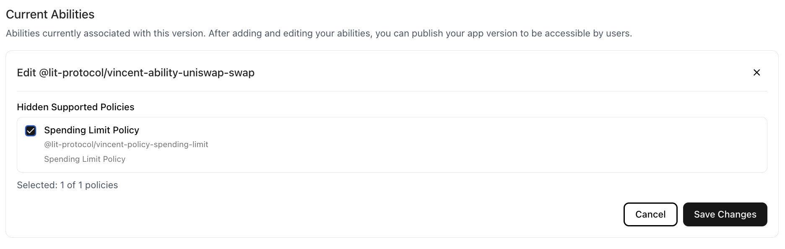
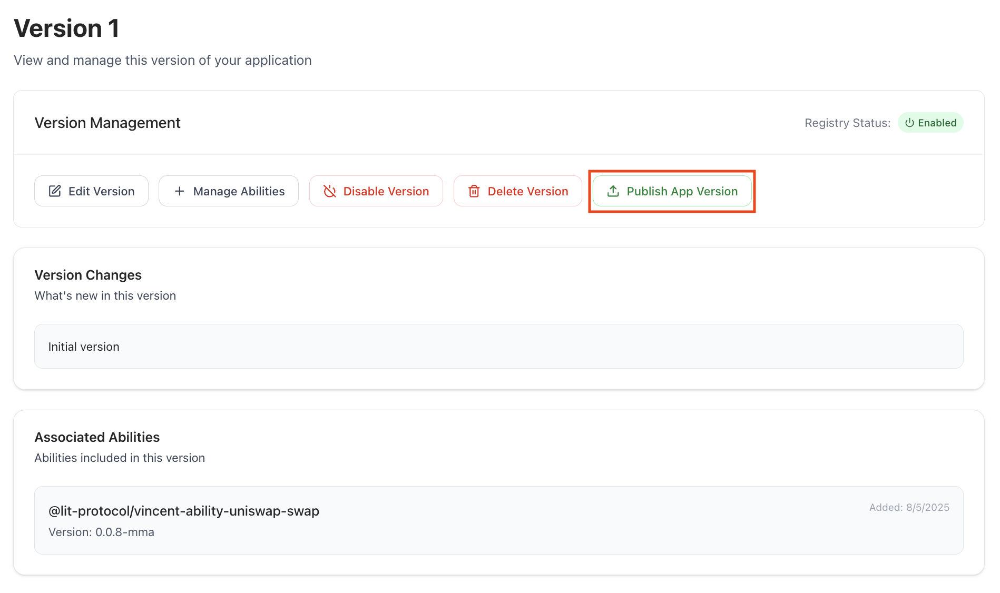

# How a Vincent App Works

  

    Info Note
  

  
In this guide, you'll create and register your first Vincent App using the <a href="https://dashboard.heyvincent.ai/">Vincent App Dashboard</a>. You’ll select from existing Vincent Abilities, optionally enable their supported Vincent Policies, configure your App's details, and register the App Delegatees whom are authorized to execute your App's Abilities.

  
If you're unfamiliar with what a Vincent App is, checkout the <a href="./Getting-Started.md">Getting Started</a> guide to learn more.

A Vincent App is composed of four key elements:

1. **Vincent Abilities**: Modular, executable functions that define the operations your App can perform on behalf of its Users.

   - Abilities can interact with blockchains, APIs, databases, or any service reachable via JavaScript and HTTP requests.
   - Each Ability is immutable once published and can only be executed under the conditions explicitly approved by the User ensuring transparent, tamper-proof behavior.

2. **Vincent Policies**: Programmable guardrails that govern when and how Vincent Abilities can be executed.

   - Policies are immutable once published, and are configurable per User ensuring that every Ability execution is tightly scoped to each User’s explicit intent.

3. **Vincent App Delegatees**: Ethereum addresses authorized by your App to execute Abilities on behalf of Vincent Users.

4. **Vincent Wallets**: Non-custodial wallets that enable secure, automated interactions between your Vincent App and its Users.

   - Each Vincent Wallet is powered by Lit Protocol's [Programmable Key Pairs (PKPs)](https://developer.litprotocol.com/user-wallets/pkps/overview), allowing Users to retain full control over their keys and assets while delegating narrowly scoped signing permissions specific to each Vincent Ability.

# Registering Your Vincent App

## Authenticating with the Vincent Dashboard

Before you can register your App, you'll need to authenticate with Vincent, so your identity is associated with the App you're creating.

This identity will be the Vincent App Manager for your new App and is responsible for creating new App Versions, defining which Vincent Abilities and Policies are used in each App Version, as well as managing the App Delegatees that are permitted to execute Abilities on behalf of your App's Vincent Users.

You can choose which ever authentication method you prefer to create your account with Vincent, and use the same identity in the future to login to the Vincent Dashboard.

## Creating your App

After authenticating with Vincent, you'll be redirected to the Vincent Dashboard. Here you can see an overview of the Vincent Apps associated with your account, as well as a button to create a new App:

After clicking the `Create an app` button, you'll be directed to a form to define your App's details.

### Your Vincent App Details

### App Name

The name will be used to identify your App within the Vincent ecosystem, and will be displayed to your users when they're consenting to delegate their Vincent Wallets to your App.

### Contact Email

This is an email address your Vincent App Users can use to get in contact with you if they have any questions about your App.

### App Description

This description will be shown to your Vincent App Users when they are asked to delegate their Vincent Wallets to your App. Clearly explain what your App will do on their behalf. For example, if your App helps optimize yield on user deposits, include details such as the expected ROI, which protocols your App interacts with, and any other important information your users should know before granting access.

### App User URL

This URL is displayed to the Vincent User when they're consenting to delegate their Vincent Wallets to your App. Generally this should be the homepage of your App's website, or a page where users can learn more about your App and what it's offering to do on their behalf.

### App Logo

The logo is displayed to your users when they're consenting to delegate their Vincent Wallets to your App.

### Redirect URIs

When Vincent Users authenticate with Vincent and give consent to your Vincent App, they'll be given a Json Web Token (JWT) that contains information like their Vincent Wallet ETH address, and the version of your App they've consented to delegate to.

  

    Info Note
  

  
After signing into your Vincent App using Vincent, these redirect URIs are the only valid endpoints the App User can be redirected to, so that your App can receive the Vincent JWT.

### Delegatee Addresses

The Ethereum addresses you specify here will be who is allowed to execute the Vincent Abilities you've selected for your App on behalf of your Vincent App Users.

This list of addresses can be updated at any time after creating your App.

### Deployment Status

This setting will be used to filter the Apps displayed in the Vincent App Registry, so that `DEV` and `TEST` Apps are not displayed to Vincent Users when looking at the Registry. Use:

- `DEV` If you're currently developing the Vincent App and it's not ready to be used by your Vincent Users
- `TEST` If you're currently testing the Vincent App with your Vincent Users, and want to make the distinction that your App is not yet ready for production
- `PROD` If you've finished development and your App is ready to be used by your Vincent Users

# Adding Vincent Abilities to your App

After filling in your App's details and clicking the `Create App` button, you'll be redirected to the Vincent App Ability management screen for your App's current version where you can add the [Vincent Abilities](../Ability-Developers/Getting-Started.md) that allow your App to perform actions on behalf of the Vincent App Users that have delegated access to their Vincent Wallets to your App.

## Adding Abilities to the App Version

In Vincent, App Versions are immutable once published and made available to your Vincent App Users to delegate to. This is a security feature that ensures Vincent App Users always know exactly which Vincent Abilities they've consented to delegate to your App, and they can never be changed without the App User consenting to a new version of your App.

Because each App Version's Vincent Abilities are immutable once published, you'll need to create and publish a new version of your App to add or remove Abilities.

> **Note:** Learn more about App Versioning and upgrading your App in the [Upgrading Vincent Apps](./Upgrading-Apps.md) guide.

After clicking the `+ Add Abilities to Version` button, you'll be shown a modal with a list of all the available Vincent Abilities:

> **Note:** If you're not seeing a Vincent Ability available to do what you need, checkout the [Creating a Vincent Ability](../Ability-Developers/Creating-Abilities.md) guide to learn how to create your own Vincent Abilities to perform any on or off-chain action your Vincent App needs.

> **Note:** Clicking any of the `Package Name`s for the displayed Abilities will take you to the NPM package page for the Ability, where you can learn more about the Ability and what it enables your App to do on behalf of your Vincent App Users.

Clicking on any of the Abilities will add that Ability to your App's version, and you can see all the enabled Abilities for the Version under `Current Abilities`. In this section you can click the trashcan icon to remove an Ability from the Version, or click the edit button to view what Vincent Policies are supported for the Ability.

### Enabling Vincent Policies for Abilities

Each Vincent Ability has a list of supported Vincent Policies that can govern the execution of the Ability. Enabling a Policy for any Ability will allow your Vincent App Users to configure guardrails for the Ability's execution.

For example, we've added the `@lit-protocol/vincent-ability-uniswap-swap` Ability to our App Version, and we can see that it supports the `@lit-protocol/vincent-policy-spending-limit` Policy.

Clicking the NPM logo for the Policy will take us to the Policy's NPM package page, where we can see that the Policy allows Vincent App Users to configure a maximum daily spending limit for the Ability.

So when a Vincent App User is delegating access to their Vincent Wallet to your App to execute the `@lit-protocol/vincent-ability-uniswap-swap` Ability, they'll be able to configure a maximum daily spending limit that restricts how much USD your App is permitted to swap on their behalf using the Ability.

# Publishing your App Version

After adding the Vincent Abilities to your App Version, and enabling the Vincent Policies you'd like to use for each Ability, the next step is to publish your App Version so that your Vincent App Users can start delegating to it.

By clicking the `Version 1 (Active)` menu item in the side bar menu:

You can navigate back to the App Version dashboard where you will see a button to `Publish App Version`:

Clicking it will publish your App Version to the Vincent App Registry, making it available to your Vincent App Users to start delegating to it.

# Wrapping Up

You’ve now learned how to create and register a Vincent App using the [Vincent App Dashboard](https://dashboard.heyvincent.ai/).

From configuring App's details to selecting Abilities and enabling their supported Policies, you’ve completed the full setup process to launch your Vincent App and start executing Vincent Abilities on behalf of your Vincent Users.

Here’s a quick recap of what you covered:

- **Understanding the Core Concepts:** A Vincent App is composed of the following components that work together to enable trusted automation without sacrificing User control:
  - Vincent Abilities (what your App can do)
  - Vincent Policies (User defined guardrails for the Abilities)
  - App Delegatees (Ethereum addresses authorized to execute Abilities)
- **Registering Your App:** Use the Vincent App Dashboard to define your App including details such as it's name, description, authorized redirect URIs, and the selected Abilities and Policies.
- **Selecting Vincent Abilities:** Choose from existing Abilities like ERC20 Approvals or Uniswap Swaps, or build your own Abilities to define the actions your App can perform on behalf of it's Users.
  - **Enabling Vincent Policies:** Enable programmable constraints for each Ability such as spending limits or token allowlists that ensure each Ability execution respects the User’s intent for your Vincent App.
- **Adding Delegatees:** Specify the Ethereum addresses that will act on behalf of your Vincent App to execute Abilities Users have permitted.
- **Publishing your App Version:** Publish your App Version to the Vincent App Registry, making it available to your Vincent App Users to start delegating to it.

## Next Steps

- If your App requires the ability to perform an action not offered by existing Vincent Abilities, checkout how to get started with [Creating a Vincent Ability](../Ability-Developers/Getting-Started.md) to learn how to perform any on or off-chain action your Vincent App needs.
- To expose your Vincent App to AI Agents in an MCP Server, check out our [Model Context Protocol Server](./MCP.md) guide.
