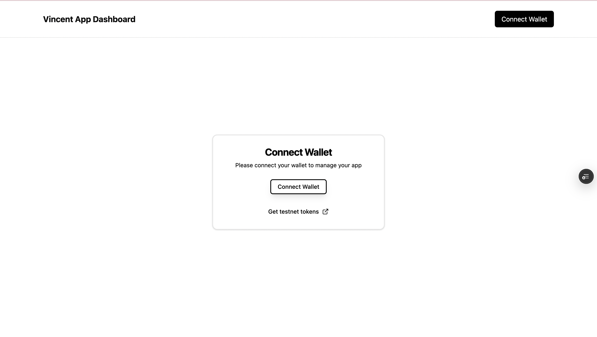

# How a Vincent App Works

<div class="box warning-box">
  <p class="box-title warning-box-title">
    <span class="box-icon warning-icon">Warning</span> Vincent is in Alpha
  </p>
  <p>The Vincent App Registry is under active development and is subject to change.</p>
  <p>Vincent Apps and their registered delegations created during the Alpha phase <strong>will not persist</strong> after the App Registry is finalized.</p>
</div>

<div class="box info-box">
  <p class="box-title info-box-title">
    <span class="box-icon info-icon">Info</span> Note
  </p>
  <p>In this guide, you'll create and register your first Vincent App using the <a href="https://dashboard.heyvincent.ai/">Vincent App Dashboard</a>. You’ll select from existing Vincent Tools and Policies, configure your App metadata, and register the App Delegatees whom are authorized to execute your App's Tools.</p>
  <p>If you're unfamiliar with what a Vincent App is, checkout the <a href="./Getting-Started.md">Getting Started</a> guide to learn more.</p>
</div>

A Vincent App is composed of four key elements:

1. **Vincent Tools**: Modular, executable functions that define the operations your App can perform on behalf of its Users.

- Tools can interact with blockchains, APIs, databases, or any service reachable via JavaScript and HTTP requests.
- Each Tool is immutable once published and can only be executed under the conditions explicitly approved by the User ensuring transparent, tamper-proof behavior.

2. **Vincent Policies**: Programmable guardrails that govern when and how Vincent Tools can be executed.

- Policies are immutable once published, and are configurable per User ensuring that every Tool execution is tightly scoped to each User’s explicit intent.

3. **Vincent App Delegatees**: Ethereum addresses authorized by your App to execute Tools on behalf of Vincent Users.

4. **Vincent Agent Wallets**: Non-custodial wallets that enable secure, automated interactions between your Vincent App and its Users.

- Each Agent Wallet is powered by Lit Protocol's [Programmable Key Pairs (PKPs)](https://developer.litprotocol.com/user-wallets/pkps/overview), allowing Users to retain full control over their keys and assets while delegating narrowly scoped signing permissions specific to each Vincent Tool.

# Defining Your Vincent App

Before registering your Vincent App, you’ll need to decide on the core components that make up its behavior and the Policies your App Users will use to govern its execution.

# 1. Selecting Vincent Tools

Vincent Tools define the executable operations your App can perform on behalf of its Users such as swapping tokens, transferring assets, or querying APIs.

<div class="info-box">
  <p class="box-title info-box-title">
    <span class="box-icon info-icon">Info</span> Note
  </p>
  <p>A Vincent Tool Registry that contains a list of all the available Vincent Tools and their associated Policies will be available soon.</p>

  <p>For now you'll need to manually copy and paste the IPFS CID of each Vincent Tool you'd like to use in your App into the Vincent App Dashboard when registering your App.</p>
  <p>The below table includes links to the IPFS CID of each Tool that will be automatically updated as new iterations of the Tool are published.</p>

  <p>Join the <a href="https://t.me/+aa73FAF9Vp82ZjJh">Vincent Community</a> to stay up to date.</p>
</div>

The following Vincent Tools have been published by the Vincent team and are available to use in your Vincent App:

| Tool                                                                                                        | Description                                                                                                                                          | IPFS CID                                                                                                                             |
| ----------------------------------------------------------------------------------------------------------- | ---------------------------------------------------------------------------------------------------------------------------------------------------- | ------------------------------------------------------------------------------------------------------------------------------------ |
| [ERC20 Token Approval](https://github.com/LIT-Protocol/Vincent/tree/main/packages/apps/tool-erc20-approval) | Allows Vincent Apps to get token approvals from Vincent Users to execute ERC20 token transfers                                                       | [Link](https://github.com/LIT-Protocol/Vincent/blob/main/packages/apps/tool-erc20-approval/src/generated/vincent-tool-metadata.json) |
| [Uniswap Swap Tool](https://github.com/LIT-Protocol/Vincent/tree/main/packages/apps/tool-uniswap-swap)      | Allows Vincent Apps to perform swaps using Uniswap on any [chain supported by the Uniswap SDK](https://api-docs.uniswap.org/guides/supported_chains) | [Link](https://github.com/LIT-Protocol/Vincent/blob/main/packages/apps/tool-uniswap-swap/src/generated/vincent-tool-metadata.json)   |

Additionally, you can checkout the [Creating a Vincent Tool](../Tool-Developers/Creating-Tools.md) guide to learn how to create your own Vincent Tools to perform any on or off-chain action your Vincent App needs.

# 2. Selecting Vincent Policies

Vincent Policies are programmable constraints that govern when and how each Vincent Tool can be executed.

<div class="box info-box">
  <p class="box-title info-box-title">
    <span class="box-icon info-icon">Info</span> Note
  </p>
  <p>Similar to selecting which Vincent Tools you'd like your App to use, you'll need to manually copy and paste the IPFS CID of each Vincent Policy you'd like to use for each Tool into the Vincent App Dashboard when registering your App.</p>
  <p>The below table includes links to the IPFS CID of each Policy that will be automatically updated as new iterations of the Policy are published.</p>
</div>

The following Vincent Policies have been published by the Vincent team and are available to use in your Vincent App:

| Tool                                                                                                          | Description                                                                                       | IPFS CID                                                                                                                                 |
| ------------------------------------------------------------------------------------------------------------- | ------------------------------------------------------------------------------------------------- | ---------------------------------------------------------------------------------------------------------------------------------------- |
| [Daily Spending Limit](https://github.com/LIT-Protocol/Vincent/tree/main/packages/apps/policy-spending-limit) | Allows Vincent Users to restrict the amount of USD spent per day on their behalf by a Vincent App | [Link](https://github.com/LIT-Protocol/Vincent/blob/main/packages/apps/policy-spending-limit/src/generated/vincent-policy-metadata.json) |

Additionally, you can checkout the [Creating a Vincent Policy](../Policy-Developers/Creating-Policies.md) guide to learn how to create your own Vincent Policies to govern the execution of Vincent Tools.

# 3. Registering Your Vincent App

<div class="box info-box">
  <p class="box-title info-box-title">
    <span class="box-icon info-icon">Info</span> Before registering your Vincent App
  </p>
  <p>Registering an App requires that you have tokens on Lit Protocol's Yellowstone blockchain to pay for gas. You can use <a href="https://chronicle-yellowstone-faucet.getlit.dev/">this faucet</a> to get the Lit test tokens used to pay for registering your App.</p>
</div>

Once you've selected your Vincent Tools and Policies, you'll need to register your App using the [Vincent App Dashboard](https://dashboard.heyvincent.ai/).

> **Note:** When you register your App, you'll be creating the first App Version that Users can permit their delegation for. App Versions are immutable meaning you can't change the Tools or Policies associated with an App Version once it's been published.
>
> To make changes to the Tools and Policies your App uses, you'll need to create a new App Version. Learn more about App Versioning in [this guide](./Upgrading-Apps.md#how-app-versioning-works).

## Connecting your App Management Wallet to the App Dashboard

Before you can register your App, you'll need to connect an Ethereum wallet to the App Dashboard.

This wallet will be the Vincent App Manager for your new App and is responsible for creating new App Versions, defining which Vincent Tools and Policies are used in each App Version, as well as the managing the App Delegatees that are permitted to execute Tools on behalf of your App's Vincent Users.



## Creating your App

After connecting your Vincent App Manager wallet to the App Dashboard, you can create a new App by clicking on the `Create New App` button which will take you to the following screen:


On this screen you'll need to define the following:

### Application Name & Description

This is the name of your App that will be used to identify your App within the Vincent ecosystem, and the description used to detail what your App is offering to do on behalf of its Users.

It's also displayed to the Vincent User when they are interacting with the Vincent Consent page to permit delegation to your App and configure their Policy parameters.

In this example image, `Automated Memecoin Dollar-Cost-Averaging` is the name of the Vincent App, and `This demo agent automatically identifies and purchases the top-performing Base memecoin on your predefined schedule.` is the description of the App:


### App Mode

Defines the current deployment status of your App.

This setting will be used to filter the Apps displayed in the Vincent App Registry, so that `DEV` and `TEST` Apps are not displayed to Vincent Users when looking at the Registry. Use:

- `DEV` If you're currently developing the Vincent App and it's not ready to be used by your Vincent Users
- `TEST` If you're currently testing the Vincent App with your Vincent Users, and want to make the distinction that your App is not yet ready for production
- `PROD` If you've finished development and your App is ready to be used by your Vincent Users

### Authorized Redirect URIs

This is a list of URLs that are authorized to receive the Json Web Token (JWT) from the Vincent Consent page.

After Vincent Users have permitted delegation to your App, or are logging back into your App using Vincent, these redirect URIs are the only valid locations they can be redirected to from the Vincent Consent page back to your App.

Included in the URL parameters of the redirect URI is a Json Web Token (JWT) that is given to your App to identify the Vincent User and the App Version they've authorized. This allows you to know which Vincent Tools and Policies the User has permitted your App to execute on their behalf.

### Tools

This section is where you'll define the IPFS CIDs of each Vincent Tool that will be used in your App. You can copy and paste the IPFS CID of each Tool you'd like your App to use into this section.

For the available Tools, see the [Selecting Vincent Tools](#1-selecting-vincent-tools) section which contains links to the IPFS CIDs for each Tool, or use the IPFS CID of any custom Tool you've developed.

> **Note:** The [Creating a Vincent Tool](../Tool-Developers/Creating-Tools.md) guide contains instructions for how to create your own Vincent Tools to perform any on or off-chain action your Vincent App needs.

#### Policies

Each Vincent Tool has a list of supported Vincent Policies that can govern the execution of the Tool. It's up to you to select which Policies your Users can configure for each Tool your App uses.

You can add Policies for each Tool by clicking the `Add Policy` button and copy and pasting the IPFS CID of each Policy.

For the Tools mentioned in the [Selecting Vincent Tools](#1-selecting-vincent-tools) section, the following Policies are supported:

| Tool                                                                                                        | Supported Policies                                                                                            | Policy IPFS CID                                                                                                                          |
| ----------------------------------------------------------------------------------------------------------- | ------------------------------------------------------------------------------------------------------------- | ---------------------------------------------------------------------------------------------------------------------------------------- |
| [ERC20 Token Approval](https://github.com/LIT-Protocol/Vincent/tree/main/packages/apps/tool-erc20-approval) | None                                                                                                          | -                                                                                                                                        |
| [Uniswap Swap Tool](https://github.com/LIT-Protocol/Vincent/tree/main/packages/apps/tool-uniswap-swap)      | [Daily Spending Limit](https://github.com/LIT-Protocol/Vincent/tree/main/packages/apps/policy-spending-limit) | [Link](https://github.com/LIT-Protocol/Vincent/blob/main/packages/apps/policy-spending-limit/src/generated/vincent-policy-metadata.json) |

#### Policy Parameters

Each Policy has parameters that can be configured by the Vincent User to explicitly define the conditions under which the Tool can be executed.

This section is where you'll define the parameters Users can configure for each Tool Policy.

Each Policy has a parameter name and type, where the name and type of each parameter must match what the Policy is expecting.

For the Policies mentioned in the [Selecting Vincent Policies](#2-selecting-vincent-policies) section, the following parameters are supported:

| Policy                                                                                                        | Parameter Name                    | Parameter Type |
| ------------------------------------------------------------------------------------------------------------- | --------------------------------- | -------------- |
| [Daily Spending Limit](https://github.com/LIT-Protocol/Vincent/tree/main/packages/apps/policy-spending-limit) | `maxDailySpendingLimitInUsdCents` | `uint256`      |

After defining the above details for your App, you can click on the `Submit Application` button to create your App. This will prompt you to sign a transaction using your App Management Wallet to register your App on-chain using the Lit Protocol [Chronicle Yellowstone blockchain](https://developer.litprotocol.com/connecting-to-a-lit-network/lit-blockchains/chronicle-yellowstone).

## Adding Delegatees to your App

In order to execute your App's Vincent Tools, you'll need to register App Delegatees. These delegatees are defined as Ethereum addresses that are authorized by your App to execute the Tools that Vincent Users have permitted for your App.

After creating your App, you'll be redirected to the dashboard overview screen. Click the box with the name of the App you just created, and you'll be taken to the App's settings screen.

Next click the `Manage Delegatees` button to add the App Delegatees you'd like to authorize to execute your App's Vincent Tools:


You will now be given two buttons:

- `Generate Delegatee` - This will generate a new Ethereum wallet giving you the private key and Ethereum address of the new wallet
  - Use this option if you don't have an existing wallet you'd like to use as an App Delegatee
- `Add Delegatee` - This will prompt you to provide the Ethereum address of an existing wallet you'd like to authorize as an App Delegatee

Whether you choose to generate a new wallet or add an existing wallet, you'll be prompted to sign a transaction using your App Management Wallet to register the App Delegatee on-chain using the Lit Protocol [Chronicle Yellowstone blockchain](https://developer.litprotocol.com/connecting-to-a-lit-network/lit-blockchains/chronicle-yellowstone).

## Generating Your App Link

At this point you have registered and configured your Vincent App, and it's ready to start having Vincent Users delegate to it.

In order to do this, User needs to have a link to the Vincent Consent page that has your App's metadata. This link can be generated for you by clicking the `Generate App URL` button on the App's settings screen:


You will be prompted to select which Authorized Redirect URI (you configured in the [Creating your App](#creating-your-app) section) you'd like Users to be redirected to after they've permitted delegation to your App, or are logging back into your App using Vincent.

After selecting the Authorized Redirect URI, click on the `Copy Application URL` button to copy the link to the Vincent Consent page for your App to your clipboard. The link will look similar to:

```
https://dashboard.heyvincent.ai/appId/526/consent?redirectUri=https%3A%2F%2Fyour-redirect-uri.com
```

You can now share this link to allow Users to delegate the ability to execute your App's Vincent Tools on their behalf.

# Wrapping Up

You’ve now learned how to create and register a Vincent App using the [Vincent App Dashboard](https://dashboard.heyvincent.ai/).

From selecting Tools and Policies to configuring App metadata and adding Delegatees, you’ve completed the full setup process to launch your Vincent App and start executing Vincent Tools on behalf of your Vincent Users.

Here’s a quick recap of what you covered:

- **Understanding the Core Concepts:** A Vincent App is composed of the following components that work together to enable trusted automation without sacrificing User control:
  - Vincent Tools (what your App can do)
  - Vincent Policies (User defined guardrails)
  - App Delegatees (Ethereum addresses authorized to execute Tools)
- **Selecting Vincent Tools:** Choose from existing Tools like ERC20 Approvals or Uniswap Swaps, or build your own Tools to define the actions your App can perform on behalf of it's Users.
- **Selecting Vincent Policies:** Add programmable constraints to each Tool such as spending limits or token allowlists that ensure each execution respects the User’s intent.
- **Registering Your App:** Use the Vincent App Dashboard to define your App including details such as it's name, description, authorized redirect URIs, and the selected Tools and Policies.
- **Adding Delegatees:** Specify the Ethereum addresses that will act on behalf of your Vincent App to execute Tools Users have permitted.
- **Generating Your App Link:** Generate a Vincent Consent URL that lets Users delegatee access to their Vincent Agent Wallets, so that your App Delegatees can execute Tools on their behalf.

## Next Steps

- If your App requires the ability to perform an action not offered by existing Vincent Tools, checkout how to get started with [Creating a Vincent Tool](../Tool-Developers/Getting-Started.md) to learn how to perform any on or off-chain action your Vincent App needs.
- If the existing Vincent Policies don't meet your App's needs, checkout how to get started with [Creating a Vincent Policy](../Policy-Developers/Getting-Started.md) to learn how to create your own Vincent Policies to govern the execution of Vincent Tools.
