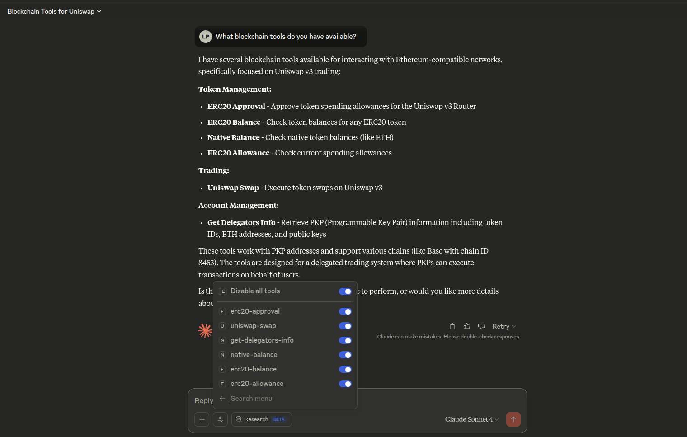

# MCP - Model Context Protocol

Any Vincent App can be converted into a Model Protocol Server (MCP) that can be consumed by any Large Language Model (LLM) with support for the MCP standard.

We provide an [implementation of an MCP Server](https://github.com/LIT-Protocol/Vincent/tree/main/packages/apps/mcp), connectable through STDIO and HTTP transports. You can use it (forking or [using `npx`](https://www.npmjs.com/package/@lit-protocol/vincent-mcp-server)) with your keys and Vincent Apps or you can customize the whole process to make your own Vincent MCP Server.

By following this process, your Vincent App tools will be exposed to LLMs as a set of MCP tools. The MCP server can also be extended with custom tools and prompts to suit your specific needs.

And if you're building an AI application, check out our [OpenAI AgentKit demo](https://github.com/LIT-Protocol/Vincent-MCP-OpenAI-AgentKit) for a guide on how to integrate your Vincent App with the OpenAI AgentKit.

## Converting a Vincent App to an MCP Server

The first step is to convert your Vincent App into an MCP server. This is done by using the `getVincentAppServer(...)` function from the `@lit-protocol/vincent-mcp-sdk` package.

```typescript
import { ethers } from 'ethers';
import { getVincentAppServer, VincentAppDef } from '@lit-protocol/vincent-mcp-sdk';

// Create a signer using your Vincent App delegatee private key
const provider = new ethers.providers.JsonRpcProvider(
  'https://mainnet.infura.io/v3/YOUR_INFURA_KEY',
);
const wallet = new ethers.Wallet('YOUR_PRIVATE_KEY', provider);

// Fill with your Vincent application data. Everything added here will be exposed to the LLM
const appDef: VincentAppDef = {
  id: '8462368',
  version: '1',
  name: 'My Vincent App',
  description: 'A Vincent application that executes tools for its delegators',
  tools: {
    QmIpfsCid1: {
      name: 'myTool',
      description: 'A tool that does something',
      parameters: [
        {
          name: 'param1',
          type: 'string',
          description: 'A parameter that is used in the tool to do something',
          optional: true,
        },
        // Add more parameters here
      ],
    },
    // Add the other tools in your Vincent App here
  },
};

// Create the MCP server. Next we will connect it to a transport to expose it to the LLM
const server = await getVincentAppServer(wallet, appDef);
```

You can check the [Uniswap Swap example app json](https://github.com/LIT-Protocol/Vincent/blob/main/packages/apps/mcp/vincent-app.example.json) for a complete Vincent App definition.

## Extending the MCP Server

At this moment you can add more tools, resources or prompts to the server.

```typescript
server.tool(...);
server.resource(...);
server.prompt(...);
```

These tools, resources and prompts will be exposed in the server along with the ones from the Vincent App definition. Consider adding any other tools that you want to be executed by the LLM and that are not Vincent Tools such as tools to query balance or fetch useful data from external sources.

## Picking a Transport

Next, you need to choose a transport mechanism to expose your MCP server to the LLM. The most common transports are `stdio` and `http`.

### STDIO Transport

Because STDIO transport runs in your local environment, only the Vincent App delegatee can run it as it will need to provide the key material to sign the requests to the Lit Network.

```typescript
import { StdioServerTransport } from '@modelcontextprotocol/sdk/server/stdio.js';

// Connect the server to a transport (e.g., stdio for CLI-based LLM tools)
const stdioTransport = new StdioServerTransport();
await server.connect(stdioTransport);
```

In this case, the LLM client will execute this script to connect to the MCP server as a child process. Beware of polluting the `stdout` with logs, as it might break the JSON-RPC communication.

### HTTP Transport

HTTP Transport can be publicly exposed to the internet.

The delegatee still has to provide the key material to sign the requests sent to the Lit Network, making him the one that has to host the server.

But as this transport can be made public, both delegators and delegatees of the Vincent app will be able to connect. You will have to provide an authentication mechanism if you are not hosting this in a private network.

```typescript
import { StreamableHTTPServerTransport } from '@modelcontextprotocol/sdk/server/streamableHttp.js';

// Connect the server to a transport (e.g., http for HTTP-based LLM tools)
const httpTransport = new StreamableHTTPServerTransport();
await server.connect(httpTransport);

// Finally in your API endpoint handler (eg. an express middleware)
await transport.handleRequest(req, res, req.body);
```

In this case, the LLM client will send requests to the API endpoint where you are exposing the MCP server.

## Connecting to the LLM

Check your LLM Client documentation on how to connect to the MCP server with the transport you have chosen.

You can also check the [Vincent MCP package README](https://github.com/LIT-Protocol/Vincent/tree/main/packages/apps/mcp/README.md) for examples on how to connect to the server with different modes.

## Executing Tools

When the LLM or Agent decides to execute a tool, it will send a request to the MCP server with the tool name and parameters. The MCP server will then execute the tool using the delegatee key material and return the result to the LLM.

# MCP Server official implementation

For an already working MCP Server that simply wraps your Vincent App you can check our [Vincent MCP package](https://github.com/LIT-Protocol/Vincent/tree/main/packages/apps/mcp/README.md)

This MCP Server includes:

- HTTP and STDIO transports
- `.env` file support for environment definition
- App definition with a custom JSON file to define which tools and params are exposed to LLMs
- Support for delegatee and delegators in HTTP transport
  - Delegators MUST authenticate with SIWE OR their Vincent JWT
  - Delegatees MUST identify with SIWE
- Client authentication support using headers or query params to maximize compatibility
- Delegatee extras:
  - "get delegators" tool, to fetch the delegators info for the wrapped Vincent App
  - An extra delegator address param in all tools. To specify on behalf of which delegator to execute the tool
- Extra tools:
  - fetch native balance
  - fetch erc20 balance
  - fetch erc20 allowance

To execute Vincent MCP Server:

- You can fork Vincent repository and then customize the [Vincent MCP package](https://github.com/LIT-Protocol/Vincent/tree/main/packages/apps/mcp)
- Check [Vincent MCP package README.md](https://github.com/LIT-Protocol/Vincent/tree/main/packages/apps/mcp/README.md) to see how to run each server just by using an `npx` command (no forking needed)

# Platform Deployment

Easiest way to deploy your Vincent App as an MCP Server is using [Heroku](https://www.heroku.com/) or [Render](https://render.com/). Both platforms allow you to easily deploy your application without having to worry about infrastructure management. They offer free tiers for small applications, so you can start experimenting with your Vincent MCP right away.

## Initial Setup

Before deploying, you'll need to create the following two files in the root of your new repository.

1.  Create a `Dockerfile`. This file instructs the platform on how to build the environment. It sets up Node.js and copies the necessary configuration file, but skips `npm install` as we will be using `npx` to run the server directly.

    ```dockerfile
    # Dockerfile
    FROM node:20-slim
    WORKDIR /app
    COPY vincent-app.example.json .
    CMD ["npx", "@lit-protocol/vincent-mcp-server", "http"]
    ```

2.  Create the Vincent App JSON definition file. Fill it with the data of your Vincent: ID, version, name, description and tools data. Check the [Uniswap Swap example app json](https://github.com/LIT-Protocol/Vincent/blob/main/packages/apps/mcp/vincent-app.example.json) for a complete Vincent App definition.

3.  Add both files to git. Commit and push them to your repository to use as source for Heroku or Render.

## Heroku

1.  Create a new Heroku app and connect your repository.
2.  Ensure your `heroku.yml` file is configured to use the `Dockerfile` for the web process:
    ```yaml
    build:
      docker:
        web: Dockerfile
    run:
      web: npx @lit-protocol/vincent-mcp-server http
    ```
3.  Add the required environment variables in the app's settings. Check the [Vincent MCP package README](https://github.com/LIT-Protocol/Vincent/tree/main/packages/apps/mcp/README.md) for details on what variables are required.
4.  Deployment will trigger automatically on push to the connected branch.

## Render

1.  Create a new Web Service and connect your repository. If needed, adjust the root directory to match the location of your `Dockerfile`.
2.  Set the environment to `Docker`. Render will automatically find and use the `Dockerfile`.
3.  Set the start command to: `npx @lit-protocol/vincent-mcp-server http`
4.  Add your required environment variables. Check the [Vincent MCP package README](https://github.com/LIT-Protocol/Vincent/tree/main/packages/apps/mcp/README.md) for details on what variables are required.
5.  Confirm creation of the web service to deploy. Any update to the configured branch will propagate to the deployment.

# Integration with messaging APIs or LLM clients remotely

To integrate with either [OpenAI API](https://platform.openai.com/docs/guides/tools-remote-mcp) or [Anthropic API](https://docs.anthropic.com/en/docs/agents-and-tools/mcp-connector), or LLM clients that connect to public MCPs, you'll have to make your MCP server publicly accessible using the HTTP transport.

You can host your MCP server in any provider you want, such as [Heroku](https://www.heroku.com/) or [Render](https://render.com/).
Another option is using [ngrok](https://ngrok.com/) to expose your local process. Running `ngrok http 300` (adjusting the port if needed) will give you the public endpoint to reach your MCP.

When trying to connect to a messaging API, follow our [OpenAI](https://github.com/LIT-Protocol/Vincent/tree/main/packages/apps/mcp/integrations/openAI.ts) or [Anthropic](https://github.com/LIT-Protocol/Vincent/tree/main/packages/apps/mcp/integrations/anthropic.ts) examples for guidelines on how to use their messaging APIs with access to your MCP Server.

To connect with an LLM client remotely, such as [Anthropic Custom Integrations](https://support.anthropic.com/en/articles/11175166-about-custom-integrations-using-remote-mcp) insert your HTTP MCP server url as follows:


Ensure you are using the full endpoint, with the `/mcp` path if the client does not add that automatically. And you can pass any required authentication using headers or query params.

Finally, activate the integration in your chat interface. Then you will have the Vincent Tools available in your LLM client.



# Integrating into OpenAI AgentKit

Check the [OpenAI AgentKit demo](https://github.com/LIT-Protocol/Vincent-MCP-OpenAI-AgentKit) for a guide on how to integrate your Vincent App with the OpenAI AgentKit.
