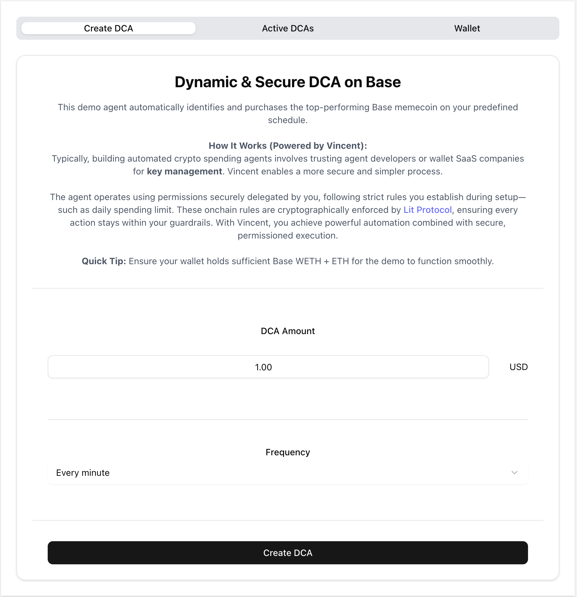
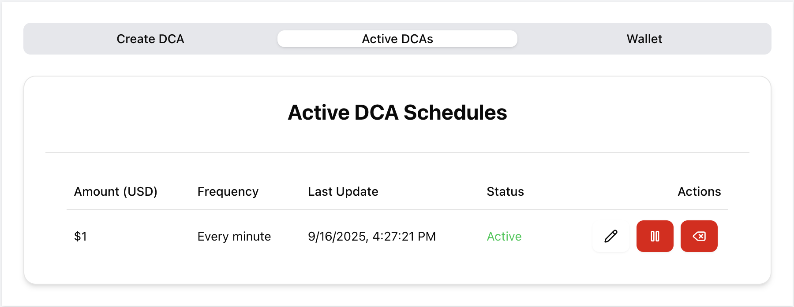

# Quick Start

The [Vincent Starter App](https://github.com/LIT-Protocol/vincent-starter-app) is a comprehensive reference implementation demonstrating how to build Vincent Apps that execute on-chain operations on behalf of Vincent users using their delegated Agent Wallets.

This monorepo provides a full-stack implementation of a Dollar-Cost Averaging (DCA) Vincent App with a frontend, backend API, and an autonomous agent that executes scheduled transactions on-chain according to the schedule permitted by the Vincent User.

This guide will walk you through setting up the Vincent Starter App, understanding its architecture, and building your first Vincent App.

## Prerequisites

- **Node.js**: `^20.11.1` or higher
- **pnpm**: `^10.7.0`
- **Docker** or a local MongoDB instance
- A Vincent App with the ERC20 Approval and Uniswap Swap Abilities
  - If you don't already have a Vincent App configured with the ERC20 Approval and Uniswap Swap Abilities, the [Creating a New Vincent App](#creating-a-new-vincent-app) section of this Quick Start will walk you through creating one

### Setting up Corepack for pnpm

The Vincent Starter App uses pnpm as its package manager. The easiest way to ensure you have the correct pnpm version installed is through Corepack, which is included with Node.js version `16.9+`:

```bash
# Verify your corepack version (should be > 0.31.0)
corepack -v

# If needed, update corepack to the latest version
npm install -g corepack@latest

# Enable Corepack globally
corepack enable

# Enable pnpm specifically
corepack enable pnpm
```

Once enabled, Corepack will automatically provision pnpm version `10.7.0` as specified in the Starter Kit's `package.json`.

## Understanding Vincent Apps

Vincent Apps act as trusted intermediaries that execute operations on behalf of Vincent users. The following are the major roles of the Vincent ecosystem:

- **Delegator**: The Vincent user who owns an Agent Wallet and delegates specific signing capabilities to your Vincent App for executing operations on their behalf

- **Delegatee**: Your Vincent App's service account that receives delegated permissions to sign and execute operations using the user's Agent Wallet within permitted boundaries

- **Agent Wallet**: The Vincent user's Agent Wallet powered by Lit Protocol's [Programmable Key Pairs (PKPs)](https://developer.litprotocol.com/user-wallets/pkps/overview) - a decentralized, multi-chain wallet managed by the Lit network

- **Vincent Abilities**: Immutable code that is granted the ability to sign and execute operations using the Vincent user's Agent Wallet within their defined boundaries (e.g. token swaps, DeFi deposits, bridging)

<div class="box info-box">
    <p class="box-title info-box-title">
        <span class="box-icon info-icon">Info</span> Note
    </p>
    <p>For more information on the concepts of Vincent Apps, Agent Wallets, and Abilities, see the <a href="../../Concepts.md">Key Concepts</a> documentation.</p>
</div>

## Creating a New Vincent App

A detailed walkthrough on how to create a new Vincent App using the Vincent Dashboard can be found [here](./Creating-Apps.md), but this section of the Quick Start will cover the steps to create a new Vincent App to be used with the Vincent Starter App example.

### 1. Log into the Vincent Developer Dashboard

Go to the [Vincent Developer dashboard](https://dashboard.heyvincent.ai/developer/dashboard) and log in with your preferred authentication method.

### 2. Create a New Vincent App

After logging in, click the `Create an app` button, or click [here](https://dashboard.heyvincent.ai/developer/create-app) to be directed to the Create App page.

### 3. Fill in the App Details

You can use test values for:

- `App Name`
- `Contact Email`
- `Description`
- `App User URL`

but the following fields require specific values:

- `Redirect URIs`: After authenticating with Vincent and permitting your Vincent App access to their Agent Wallet, these are the permitted URIs your Vincent Users are allowed to be redirected to.
  - For running the Starter App locally, you **must** add the URI: `http://localhost:5173`
- `Delegatee Addresses`: These are the addresses that are permitted to execute Vincent Abilities on behalf of your Vincent App's users.
  - This can be any EOA you have access to the private key for, but it **must** be the same EOA you'll specify in the [DCA Backend ENV file](#setting-the-backend-environment-variables-packagesdca-backendenv)

Once you've filled in the required fields, click the `Create App` button to create your new Vincent App.


### 4. Add Vincent Abilities

After creating your Vincent App, you'll be directed to the `Add Abilities` page, where you'll need to add the required Vincent Abilities for the Starter App example to function.

Click the `Add Abilities to Version` button, and click on the `ERC20 Approval` and `Uniswap Swap` Abilities to add them to your Vincent App.


### 5. Publish the App Version

After adding the Abilities, you'll need to publish the App Version to make it accessible for your Vincent Users to use.

On the left sidebar, click `Apps`, then `App Versions`, and `Version 1` to navigate to the App Version management page.

Click the `Publish App Version` button to register the App Version as published in the Vincent Registry smart contract.


### 6. Obtain your Vincent App ID

After publishing the App Version, the last thing you'll need from the Vincent Developer Dashboard is your Vincent App ID.

On the left sidebar, click `Apps Details` to navigate to the details page for your Vincent App.

Listed in the `App Information` section is your Vincent App ID - you'll need to copy this number and paste it in both the frontend and backend ENVs files as covered in the [Setting the Environment Variables](#3-configure-environment-variables) section.


## Running the Vincent Starter App

### 1. Clone the Repository

```bash
git clone https://github.com/LIT-Protocol/vincent-starter-app.git
cd vincent-starter-app
```

### 2. Install Dependencies

Install and build all packages:

```bash
pnpm install && pnpm build
```

### 3. Configure Environment Variables

The Starter App provides example ENV files for the backend and frontend packages. Copy these files to your own `.env` files:

```bash
# Backend package
cp packages/dca-backend/.env.example packages/dca-backend/.env

# Frontend package
cp packages/dca-frontend/.env.example packages/dca-frontend/.env
```

#### Setting the Backend Environment Variables (`packages/dca-backend/.env`)

| Variable                      | Required | Description                                                                                                                                                                          |
| ----------------------------- | -------- | ------------------------------------------------------------------------------------------------------------------------------------------------------------------------------------ |
| ALCHEMY_API_KEY               | No       | Alchemy API key for gas sponsorship of the ERC20 Approval transactions. Must be set together with `ALCHEMY_POLICY_ID`.                                                               |
| ALCHEMY_POLICY_ID             | No       | Alchemy gas manager policy ID for sponsored transactions. Must be set together with `ALCHEMY_API_KEY`.                                                                               |
| ALLOWED_AUDIENCE              | Yes      | Vincent JWT audience URL for Vincent authentication validation (should match frontend origin, e.g. `http://localhost:5173` during local development).                                |
| DEBUG                         | No       | Node.js debug namespaces for detailed logging. Set this variable to enable verbose logging for specific modules or all modules. If unset, debug logging is disabled by default.      |
| BASE_RPC_URL                  | Yes      | RPC URL for the Base blockchain for sending the ERC20 Approval and Uniswap Swap transactions.                                                                                        |
| COINRANKING_API_KEY           | Yes      | CoinRanking API key for fetching real-time cryptocurrency prices and meme coin data (can be obtained [here](https://account.coinranking.com/dashboard/api) after making an account). |
| CONSOLA_LEVEL                 | No       | Logging verbosity (`0=silent`, `1=fatal`, `2=error`, `3=warn`, `4=info`, `5=debug`). Set to 5 for maximum debug output.                                                              |
| CORS_ALLOWED_DOMAIN           | Yes      | Frontend origin allowed for CORS requests. In development, all origins allowed; in production, must match frontend URL.                                                              |
| DEFAULT_TX_CONFIRMATIONS      | No       | Number of block confirmations to wait for finality of sponsored transactions (default: `6`).                                                                                         |
| IS_DEVELOPMENT                | Yes      | Development environment flag (`true`/`false`). Affects CORS, logging, and error handling.                                                                                            |
| MONGODB_URI                   | Yes      | MongoDB connection string with auth credentials (e.g. `mongodb://localhost:27017/dca` during local development).                                                                     |
| PORT                          | Yes      | HTTP server port for the backend API service (default: `3000`).                                                                                                                      |
| VINCENT_APP_ID                | Yes      | Vincent App ID obtained from your [Vincent Developer dashboard](https://dashboard.heyvincent.ai/developer/dashboard).                                                                |
| VINCENT_DELEGATEE_PRIVATE_KEY | Yes      | Ethereum private key for the Vincent App Delegatee used to execute the Vincent ERC20 Approval Uniswap Swap Abilities.                                                                |

#### Setting the Frontend Environment Variables (`packages/dca-frontend/.env`)

| Variable               | Required | Description                                                                                                       |
| ---------------------- | -------- | ----------------------------------------------------------------------------------------------------------------- |
| VITE_APP_ID            | Yes      | Your Vincent App ID from your [Vincent Developer dashboard](https://dashboard.heyvincent.ai/developer/dashboard). |
| VITE_BACKEND_URL       | Yes      | Backend API endpoint URL (e.g. `http://localhost:3000` for local development).                                    |
| VITE_EXPECTED_AUDIENCE | No       | Vincent JWT audience URL for authentication validation. Defaults to `window.location.origin` if not provided.     |
| VITE_IS_DEVELOPMENT    | No       | Development mode flag (`true`/`false`). Defaults to `false`. Enables additional debugging features.               |
| VITE_REDIRECT_URI      | No       | OAuth redirect URI after Vincent authentication. Defaults to `window.location.origin` if not provided.            |

### 4. Start MongoDB (Local Development)

Build MongoDB Docker image:

```bash
pnpm -r mongo:build
```

Start a MongoDB Docker container:

```bash
pnpm -r mongo:up
```

Alternatively, use an existing MongoDB instance and update the `MONGODB_URI` in `packages/dca-backend/.env`.

### 5. Run the Application

Start all services in development mode:

```bash
pnpm dev
```

This starts:

- **Frontend**: React app on `http://localhost:5173`
- **Backend API**: Express server on `http://localhost:3000`
- **Job Worker**: Background processor for scheduled DCA tasks

At this point, you can access the Starter App example at `http://localhost:5173`, where you'll be presented with the following page:


Click the `Auth with Vincent` button to begin the Vincent authentication flow as your Vincent App Users would.

If you aren't currently logged into Vincent, you'll be prompted to login with your preferred authentication method.

After logging in, or if you were already logged in, you'll be shown the Grant Permissions page, where you'll be prompted to grant your Vincent App the ability to execute the ERC20 Approval and Uniswap Swap Abilities on behalf of your Vincent Agent Wallet, click the `Grant Permissions` button to continue.

After the Vincent delegation process is finished, you'll be redirected back to the Starter App DCA UI:



Clicking the `Create DCA` button will start the DCA process using your Vincent Agent Wallet:



If you haven't funded your Agent Wallet with WETH and ETH on Base, you'll of course get an insufficient funds error, but after funding your Agent Wallet, you'll see the Starter App example executing DCAs into the top performing meme coin on your behalf at the interval you've specified.

## Important Considerations

### Architecture

- For better scalability, run the API and worker instances on different servers for a production deployment
- Pin Vincent Ability versions in your `package.json` dependencies to prevent unexpected updates

### Version Management

- Your Vincent App can only execute the exact Vincent Ability versions your Vincent Users have approved via Vincent
- When you update which Vincent Abilities your Vincent App uses, or upgrade the versions of existing Abilities, your existing Vincent Users must permit the new version of your Vincent App which utilizes these updates

### User Permissions

- Users can revoke or modify what your Vincent App is permitted to do on their behalf at any time - handle these changes gracefully

### Execution Best Practices

- Always run an Ability's `precheck` function to catch errors early. The flow should be: `prepare` (if the Ability requires it) → `precheck` → `execute`
- The Vincent Agent Wallet pays for their own gas by default - check wallet balances before operations
- Some Vincent Abilities, such as the ERC20 Approval Ability, can sponsor gas using the Alchemy Gas Manager - this requires configuring the [Alchemy Gas Sponsorship](https://www.alchemy.com/docs/wallets/low-level-infra/gas-manager/gas-sponsorship/using-sdk/basic-gas-sponsorship)

## Getting Help

If you run into any issues setting up or running the Starter App example, reach out to us on [Telegram](https://t.me/+aa73FAF9Vp82ZjJh) for assistance.

## Disclaimers

The Vincent Starter App is a demo application and is not intended for production use without considerable modifications.

The software is provided “as is”, without warranty of any kind, express or implied, including but not limited to the warranties of merchantability, fitness for a particular purpose and noninfringement.

We make no guarantees about its stability or suitability for production use. It is provided for demo and educational purposes.

It's your responsibility to comply with all applicable laws and regulations for your jurisdiction with respect to the use of this software.
