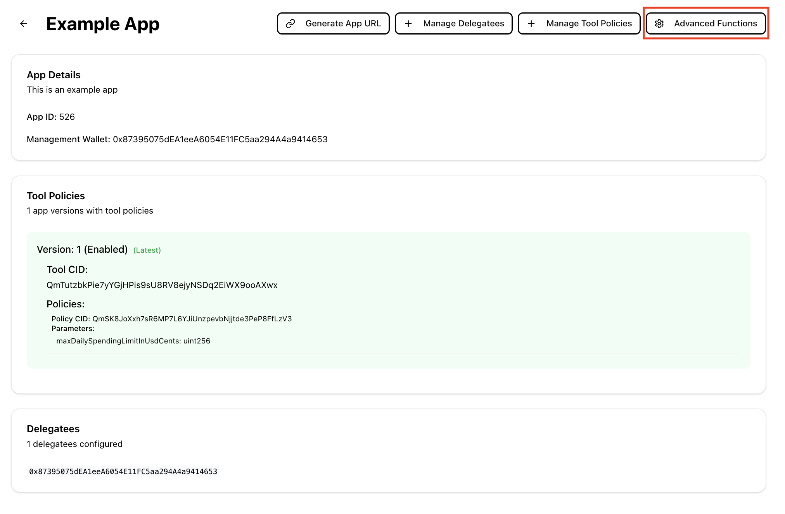
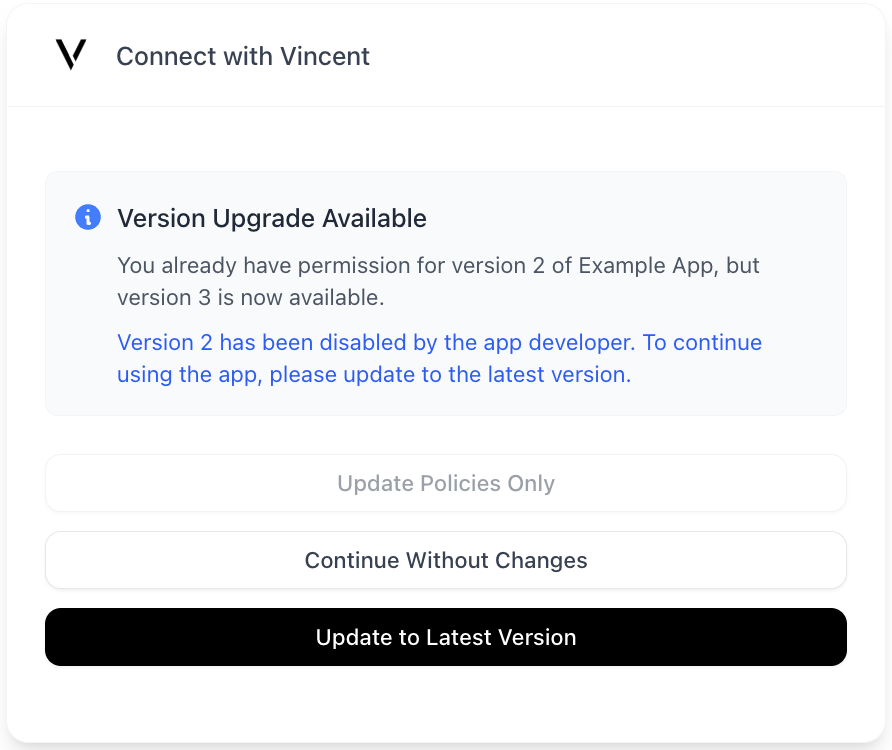

# Upgrading a Vincent App

Vincent Apps are versioned to guarantee trust and transparency. Once a Vincent App Version is published, its set of Abilities and Policies it uses are immutable. This ensures that Users know exactly what actions they’ve authorized and that App Managers cannot alter those permissions without explicit re-authorization from the User.

### Why This Matters

Vincent Users don’t just delegate to your App, they delegate to a specific App Version. This Version defines the exact set of Abilities and Policies that your App can execute on their behalf, and can never be changed. This gives your Users confidence that the set of Abilities they've authorized, and are governing with their configured Policies, will never change without their explicit consent.

# When Should You Create a New Version?

As the Vincent App Manager, you can create a new version of your App whenever you want to. Some common occasions of when you'll need to create a new Version are:

- Adding new Vincent Abilities or removing existing ones
- Upgrading existing Abilities to newer iterations
- Changing or adding the Vincent Policies available to be used with your App's selected Abilities

## When a New Version isn't Required

There are some parts of your Vincent App that you can change without creating a new Version by visiting the [Vincent App Dashboard](https://dashboard.heyvincent.ai/). For each Vincent App you've created, you can change:

- The App Delegatees that are authorized to execute your App's Abilities for all App Versions
- The authorized redirect URIs Users can be redirected to after they've authorized your App via the Vincent Consent page
- The current Deployment Status of your App

# How App Versioning Works

Each Version of your App is stored on-chain in the Vincent App Registry smart contract, with no ability to modify the Version once it's been published to the Registry.

Each App Version includes:

- A finite list of Vincent Abilities the App can execute on behalf of Users that authorize the App Version
- Each Policy that's available to be used with the App's selected Abilities, along with the Policy parameters that Users can configure

> **Note:** Once published, App Versions cannot be modified. If you need to make any changes, you'll need to publish a new Version.

# Creating a New Version

  

    Info Before creating a new App Version
  

  
Creating a new App Version requires that you have tokens on Lit Protocol's Yellowstone blockchain to pay for gas. You can use <a href="https://chronicle-yellowstone-faucet.getlit.dev/">this faucet</a> to get the Lit test tokens used to pay for creating the new App Version.

To publish a new version of your App:

1. Navigate to the [Vincent App Dashboard](https://dashboard.heyvincent.ai/)
2. Select your App from the list
3. Click the `Manage Ability Policies` button:

You will then be shown the following screen which displays:

- The current Abilities configured for your App
- The Policies that are available to be used with each Ability
- Each Policy parameter that can be configured by the User for each Policy:

After updating the Abilities and Policies for your App, you'll need to click the `Publish New Version` button to publish the Version on-chain. This will prompt you to sign a transaction with your connected Vincent App Manager wallet.

After it's published, your new App Version will be immediately available for Vincent Users to authorize/upgrade to the next time they visit your App’s Vincent Consent Page.

# Managing App Versions

Also on the Vincent App Overview page, you'll see an `Advanced Functions` button:

Clicking this button will navigate you to the advanced settings for your App, including the option to manage your App Versions:

After clicking the `Manage Versions` button, you'll be given the option to select from your App Versions. You can see which Version are currently enabled, and which are disabled:

Select the App Version you'd like to enable or disable, and click the `Enable Version` or `Disable Version` button to toggle the Version's status. This will prompt you to sign a transaction with your connected Vincent App Manager wallet to update the App's status in the on-chain App Registry.

## What Does it Mean to Enable/Disable an App Version?

Enabled App Versions mean that new Users can authorize the corresponding set of Abilities and Policies to be executed on their behalf, and existing Users of the enabled Version can continue to authenticate with Vincent for your App.

New Users will never be prompted to authorize disabled App Versions, and existing Users who've previously permitted a now disabled Version will either be prompted to update to the latest enabled Version, or will no longer be able to authenticate with Vincent for your App if there is no newer App Version to upgrade to:

> **Note:** A disabled App Version will also prohibit your App Delegatees from executing the corresponding Abilities on behalf of your Users.

The latest enabled App Version is always the version that new Users will be prompted to authorize when they visit your App’s Vincent Consent Page.

If you have multiple enabled App Versions, existing Users who've permitted previous Versions are still able to use those Versions up until the point you disable it.

However, those Users will be prompted to upgrade to the latest enabled App Version the next time they visit your App’s Vincent Consent Page:

# Best Practices

- **Clearly communicate changes** to your Users before publishing new versions, especially if you’re introducing new Abilities or modifying existing functionality.
- **Incremental changes** can be better than large overhauls, it makes it easier for Users to understand what's changed.
- **Keep old versions active** during testing to allow for safe rollout and rollback if needed.
- **Use `DEV`, `TEST`, and `PROD` App modes** appropriately to manage expectations of the stability of your App and whether it's still undergoing development.

# Wrapping Up

App Versioning is a cornerstone of Vincent’s trust model. It allows your App to evolve by adding new functionality, fixing issues, or improving User safety without ever compromising the permissions your Users originally granted.

Every App Version is:

- **Immutable:** Once published, it can never be changed
- **Transparent:** Users see exactly what Abilities and Policies they’re authorizing
- **Opt-in:** Upgrades require explicit User consent through your App's Vincent Consent Page

As the App Manager, versioning gives you control over your App’s configuration without ever taking control away from your Users.

### Key Takeaways:

- Users delegate to specific App Versions, not your App in general
- To make changes to Abilities or Policies, create a new App Version using the [Vincent App Dashboard](https://dashboard.heyvincent.ai/)
- You can enable/disable versions at any time to manage upgrades and deprecations
- Only enabled App Versions can be authorized by Users and executed by your App Delegatees

## Next Steps

- Checkout how to [Authenticate your Users with Vincent](../App-Agent-Developers/Authenticating-Users.md) to get Users to started delegating to your Vincent App.
- Dive into how to [Execute Vincent Abilities](../App-Agent-Developers/Executing-Abilities.md) and start executing Vincent Abilities on behalf of your Users.
- Learn how to [Create a Vincent Ability](../Ability-Developers/Getting-Started.md) to add new functionality to your App.
- Learn how to [Create a Vincent Policy](../Policy-Developers/Getting-Started.md) to add new governance rules to your App's Abilities.
