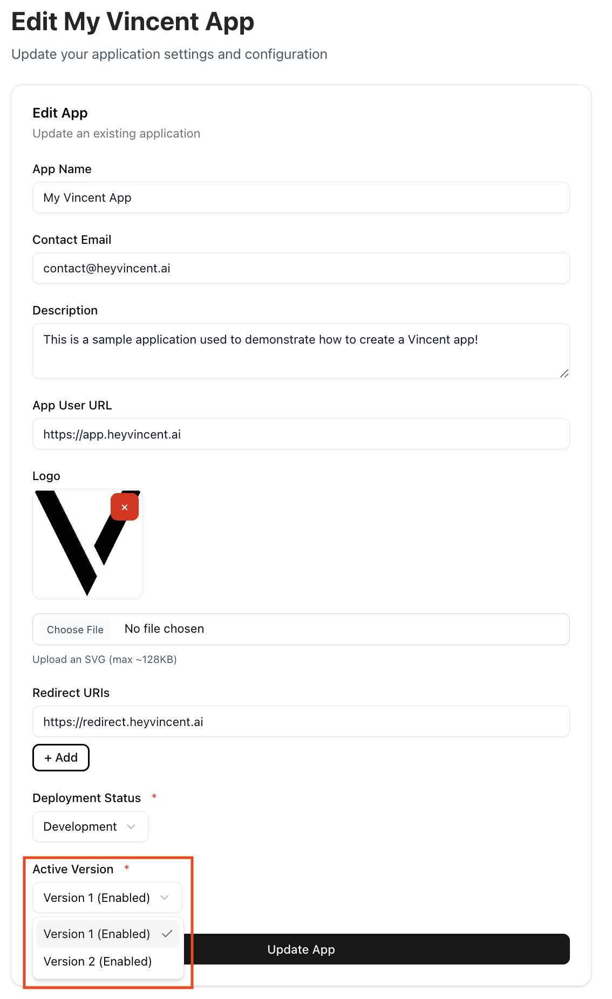
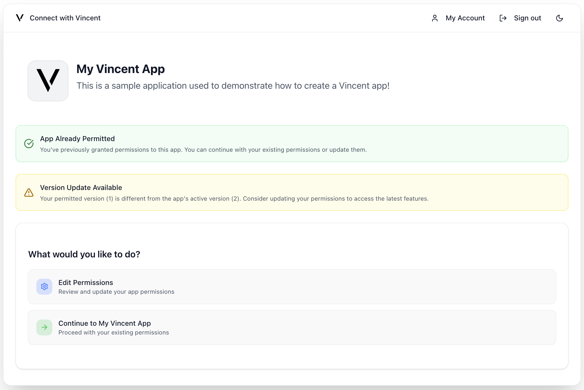
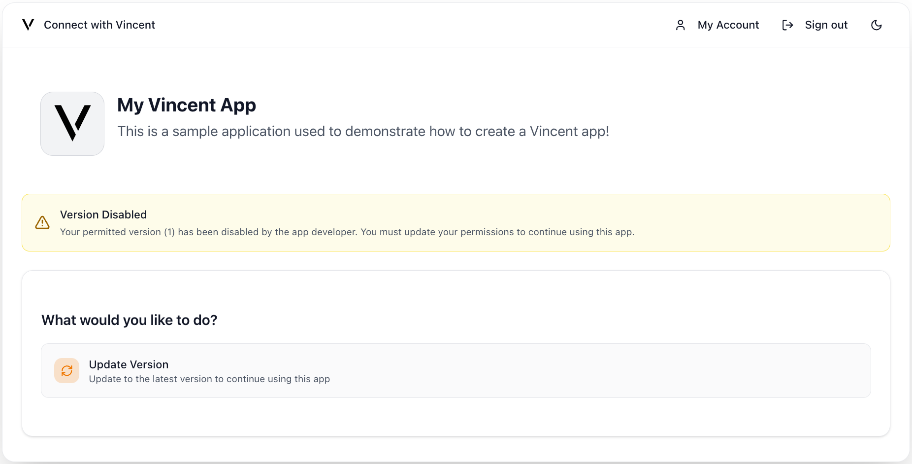

# Upgrading a Vincent App

Vincent Apps are versioned to guarantee trust and transparency. Once a Vincent App Version is published, its set of Abilities and Policies it uses are immutable. This ensures that Users know exactly what actions they’ve authorized and that App Managers cannot alter those permissions without explicit re-authorization from the User.

### Why This Matters

Vincent Users don’t just delegate to your App, they delegate to a specific App Version. This Version defines the exact set of Abilities and Policies that your App can execute on their behalf, and can never be changed. This gives your Users confidence that the set of Abilities they've authorized, and the guardrails they've configured with Policies, will never change without their explicit consent.

# When Should You Create a New Version?

As the Vincent App Manager, you can create a new version of your App whenever you want to. Some common occasions of when you'll need to create a new Version are:

- Adding new Vincent Abilities or removing existing ones
- Upgrading existing Abilities to newer iterations
- Changing or adding the Vincent Policies available to be used with your App's selected Abilities

## When a New Version isn't Required

There are some parts of your Vincent App that you can change without creating a new Version by visiting the [Vincent App Dashboard](https://dashboard.heyvincent.ai/). For each Vincent App you've created, you can change:

- The App Delegatees that are authorized to execute your App's Abilities for all App Versions
- The authorized redirect URIs Users can be redirected to after they've authorized your App via the Vincent Connect page
- The current Deployment Status of your App
- App details like the name, description, and logo

# How App Versioning Works

Each App Version includes a finite list of Vincent Abilities the App can execute on behalf of Users that authorize the App Version, as well as the enabled Vincent Policies for each Ability that are used to govern the execution of the Abilities.

App Versions have a two step flow before they're available to be delegated to by your Vincent App Users:

1. **Create the App Version** - Covered further in the [Creating a New Version](#creating-a-new-version) section, this step initializes a new App Version off-chain, allowing you to specify the Vincent Abilities and their enabled Policies to be used by the Version.
   - While the Version is saved only in the Vincent off-chain database, you are able to make changes to it's associated Abilities and enabled Policies.
2. **Publish the App Version** - This step registers the App Version on-chain in the Vincent App Registry, making it available to be set as your Vincent App's currently active App Version, so your Vincent App Users can start delegating to it.
   - Once published, the App Version is immutable and it's set of Abilities and Policies cannot be modified. If you need to make any changes, you'll need to create and publish a new Version.

# Creating a New Version

To publish a new version of your App:

1. Navigate to the [Vincent App Dashboard](https://dashboard.heyvincent.ai/)
2. Select the `App Details` menu item from the side bar menu
3. Click the `Create App Version` button:

This will display a form prompting you to describe what's changing in this new App Version. The details you provide here will be displayed to your Vincent App Users the next time they sign into your App using Vincent, so be descriptive and clear about what's changing so your users feel informed and confident in permitting delegation to the new App Version.

## Adding Abilities to the App Version

After submitting the form, you'll be redirected to the App Version dashboard where you can add the Vincent Abilities you'd like to enable for this App Version, as well as configure which Vincent Policies are enabled for each Ability.

When you're finished configuring the App Version, navigate back to the App Version dashboard by clicking the new version number menu item in the side bar menu.

When you're ready, click the `Publish App Version` button to register this new App Version on-chain, making it available to set as your Vincent App's currently active App Version.

# Setting the Active App Version

After publishing a new App Version, it's not immediately set as your Vincent App's currently active App Version. This means existing Vincent App Users who've authorized a previous App Version will not be prompted to upgrade to the new version the next time they sign into your App using Vincent. Additionally, new Vincent App Users will always be permitting the version set as the active App Version.

So to prompt existing App Users to upgrade to the new version, and have new App Users permit the new version by default, you'll need to set the new version as your Vincent App's currently active App Version. This is done on your App's Dashboard which you can navigate to by clicking the `App Details` menu item in the side bar menu.

On the App Dashboard, click the `Edit App` button to open a form where you can update the App's details, including the currently active App Version at the bottom of the form.

Select the new version you just published, and click the `Update App` button to save the changes, and the new version you published will be set as your Vincent App's currently active App Version.

# Enable/Disable App Versions

After publishing new App Versions and updating the App's active Version, you may want to disable previous App Versions to force your Vincent App Users to upgrade to newer versions.

This can be done by navigating to each App Version's dashboard (by clicking the version number menu item in the side bar menu) and clicking the `Disable App Version` button.

Clicking this button will:

- Immediately disable the App Version in the Vincent App Registry
- Prevent your Vincent App Users who have permitted this version from using your Vincent App
  - These Users will be prompted to upgrade to the latest enabled App Version to continue using your App
- Prevent your Vincent App Delegatees from executing Vincent Abilities for any Users who have authorized only the disabled App Version

Once an App Version is disabled, the button will change to `Enable App Version`. Clicking this will re-enable the App Version, allowing your Vincent App Users who are still on that version to use it again, and permitting your Vincent App Delegatees to execute Vincent Abilities for that version.

## What Do Your Vincent App Users See When Changing App Versions?

If you create a new App Version and don't publish it, or create one and publish it, your Vincent App Users will not be notified of the new version.

It's not until you set the new version as your Vincent App's currently active App Version that your existing Vincent App Users will be prompted to upgrade to the new version the next time they sign into your App using Vincent.

Here is what your App User's will see the next time they sign into your App using Vincent:

Because the App User in this screenshot has permitted an App Version that is still enabled, they're just notified that there is a new version available to upgrade to, but they are not forced to upgrade, and continue to use the version they've already permitted.

If you disable the App Version an App User has permitted, they will be prompted to upgrade to the latest enabled App Version to continue using your App:

If you disable the active App Version, but there's still an enabled App Version available, your App Users will either continue as usual if they are on an enabled Version, or be prompted to upgrade to the latest enabled App Version to continue using your App.

# Best Practices

- **Clearly communicate changes** in the descriptions of new App Versions, be descriptive and clear about what's changing so your users feel informed and confident in permitting delegation to the new App Version.
- **Incremental changes** can be better than large overhauls, it makes it easier for Users to understand what's changed.
- **Keep old versions active** during testing to allow for safe rollout and rollback if needed.
- **Use `DEV`, `TEST`, and `PROD` Deployment Statuses** appropriately to manage expectations of the stability of your App and whether it's still undergoing development.

# Wrapping Up

App Versioning is a cornerstone of Vincent’s trust model. It allows your App to evolve by adding new functionality, fixing issues, or improving User safety without ever compromising the permissions your Users originally granted.

Every App Version is:

- **Immutable:** Once published, it can never be changed
- **Transparent:** Users see exactly what Abilities and Policies they’re authorizing
- **Opt-in:** Upgrades require explicit User connection through your App's Vincent Connect Page

As the App Manager, versioning gives you control over your App’s configuration without ever taking control away from your Users.

### Key Takeaways:

- Users delegate to specific App Versions, not your App in general
- To make changes to Abilities or their enabled Policies, create a new App Version using the [Vincent App Dashboard](https://dashboard.heyvincent.ai/)
- You can enable/disable versions at any time to manage upgrades and deprecations
- Only enabled App Versions can be authorized by Users and executed by your App Delegatees

## Next Steps

- Checkout how to [Authenticate your Users with Vincent](./Auth-Users.md) to get Users to started delegating to your Vincent App.
- Dive into how to [Execute Vincent Abilities](../App-Agent-Developers/Executing-Abilities.md) and start executing Vincent Abilities on behalf of your Users.
- Learn how to [Create a Vincent Ability](../Ability-Developers/Getting-Started.md) to add new functionality to your App.
- Learn how to [Create a Vincent Policy](../Policy-Developers/Getting-Started.md) to add new governance rules to your App's Abilities.
